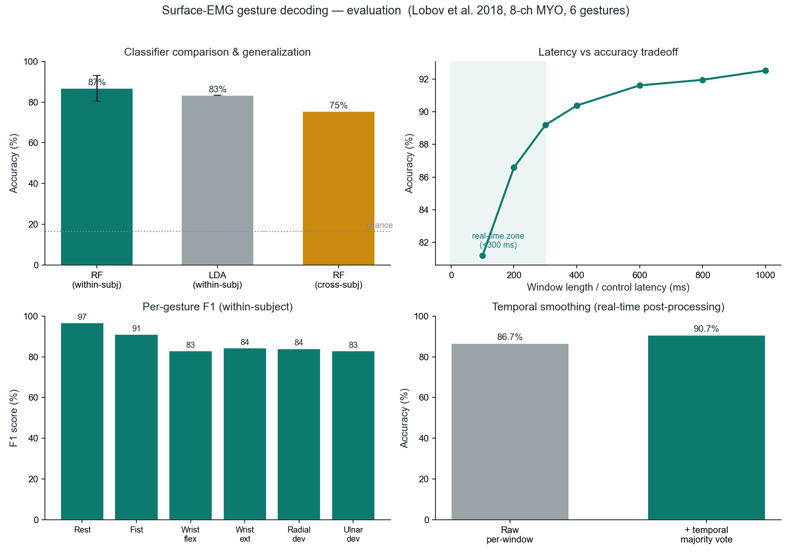

# Surface-EMG Hand-Gesture Decoding

Decoding six hand gestures from 8-channel surface electromyography (a MYO armband)
with classic time-domain features and a Random Forest, evaluated the way a
myoelectric-control study should be: cross-session, cross-subject, and with the
latency–accuracy tradeoff that matters for real-time prosthetic control.

**Headline:** 86.7% ± 6.4% mean within-subject accuracy across 35 subjects, and
**75.4% on held-out subjects the model never saw** (6 gestures, chance = 16.7%).

## What's evaluated

- **Within-subject, cross-session: 86.7% ± 6.4%.** Train on each subject's session 1,
  test on session 2, no window overlap between train and test. This is the "calibrated user" number.
- **Classifier comparison: RF 86.7% vs LDA 83.3%.** Linear Discriminant Analysis is the
  classic myoelectric baseline (Hudgins et al.); the Random Forest earns a ~3-point edge.
- **Cross-subject generalization: 75.4%.** Train on 24 subjects, test on 12 unseen ones.
  The drop from 87% to 75% is the real, expected cost of anatomy, electrode placement, and
  skin impedance varying person to person, and measuring it honestly is the point.
- **Latency vs accuracy.** Accuracy rises from ~81% at a 100 ms window to ~92% at 1 s.
  Inside the real-time control zone (<300 ms) the decoder already holds ~87 to 89%.
- **Temporal smoothing: 86.7% to 90.7%.** A short majority vote over consecutive windows,
  the post-processing a real controller uses for stable output.

Per-gesture, rest and fist are easiest (F1 97 / 91); the confusions fall between
anatomically adjacent movements (wrist flexion / ulnar deviation, wrist extension /
radial deviation), exactly as expected from the underlying muscle anatomy.

## Method

- **Data:** Lobov et al. (2018), "Latent Factors Limiting the Performance of sEMG-Interfaces,"
  *Sensors* 18(4):1122 (UCI ML Repository #481). MYO Thalmic bracelet, 8 channels @ 200 Hz,
  36 subjects, 2 sessions each, 6 gestures: rest, fist, wrist flexion, wrist extension,
  radial deviation, ulnar deviation.
- **Windowing:** 40-sample (~200 ms) windows at 50% overlap, taken within contiguous
  single-gesture segments so no window straddles a label boundary.
- **Features (per channel):** mean absolute value, RMS, waveform length, zero crossings,
  slope-sign changes (the Hudgins time-domain set), 40 features total. Chosen because they
  are cheap enough to compute in real time on embedded hardware.
- **Models:** Random Forest (200 trees) and an LDA baseline.
- **Protocols:** within-subject cross-session; leave-subjects-out cross-subject;
  a window-length sweep (20–200 samples); and a 5-window temporal majority vote.

## Run it

1. Download the dataset (UCI ML Repository #481) into `data/EMG_data_for_gestures-master/`.
2. `pip install numpy scikit-learn matplotlib`
3. `python emg_decode.py` for the headline within-subject result, or
   `python emg_research.py` for the full evaluation (comparison, cross-subject, latency, smoothing).

Author: Santiago Benavides · https://alma26x.github.io/
