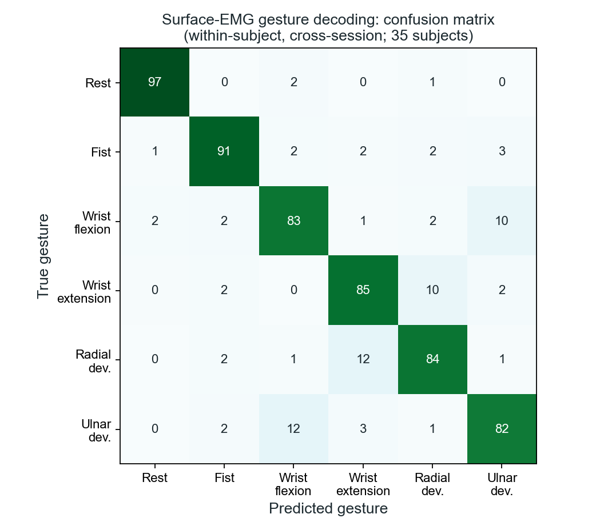
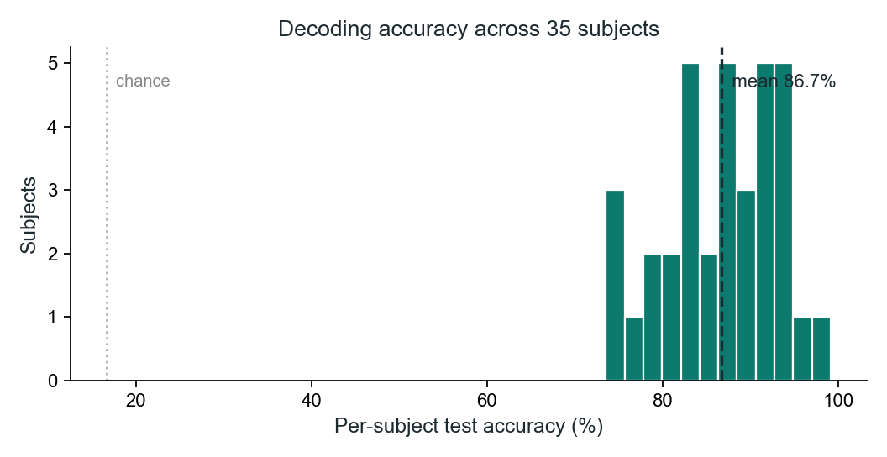

# Surface-EMG Hand-Gesture Decoding

Decoding six hand gestures from 8-channel surface electromyography (a MYO armband)
using classic time-domain features and a Random Forest.

**Result: 86.7% ± 6.4% mean within-subject accuracy** across 35 subjects
(6 gestures, chance = 16.7%), under an honest cross-session protocol: train on each
subject's session 1, test on session 2, with no window overlap between train and test.

Confusions fall predominantly between anatomically adjacent movements
(wrist flexion / ulnar deviation, wrist extension / radial deviation), as expected.

## Method
- **Data:** Lobov et al. (2018), "Latent Factors Limiting the Performance of sEMG-Interfaces," *Sensors* 18(4):1122 (UCI ML Repository #481). MYO Thalmic bracelet, 8 channels, 36 subjects, 2 sessions each, 6 gestures: rest, fist, wrist flexion, wrist extension, radial deviation, ulnar deviation.
- **Windowing:** 40-sample windows (~200 ms) at 50% overlap, taken within contiguous single-gesture segments.
- **Features (per channel):** mean absolute value, RMS, waveform length, zero crossings, slope-sign changes (the Hudgins time-domain set) — 40 features total.
- **Model:** Random Forest (200 trees).
- **Evaluation:** per subject, fit on session 1 and test on session 2, then averaged across subjects.

## Run it
1. Download the dataset (UCI ML Repository #481) so the per-subject folders sit under `data/EMG_data_for_gestures-master/`.
2. `pip install numpy scikit-learn matplotlib`
3. `python emg_decode.py`

Author: Santiago Benavides · https://alma26x.github.io/
